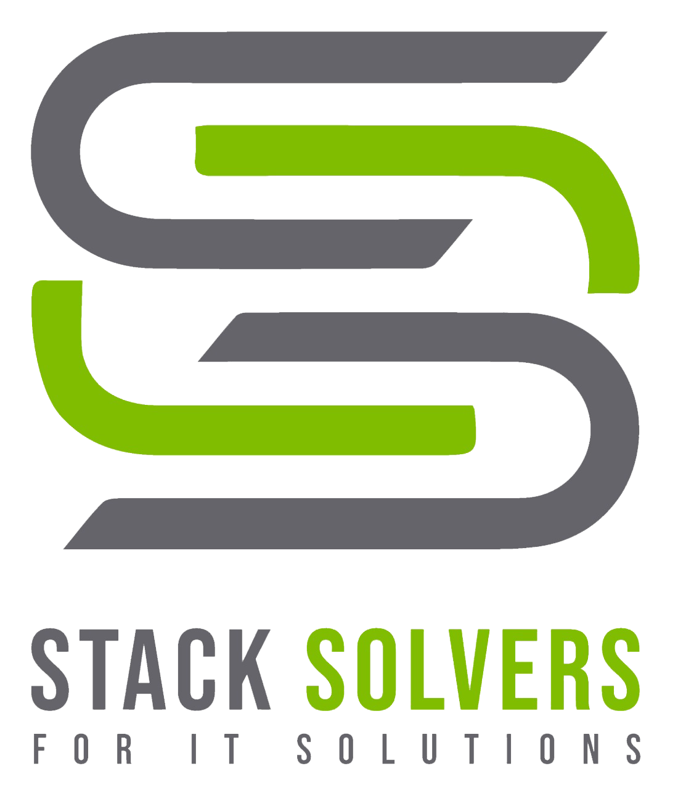

<p align="center">
  
</p>

# TokenLens

TokenLens is a local, privacy-first dashboard and MCP server for understanding how AI agents spend tokens across projects, sessions, and chats.

Produced by Stack Solvers for IT Solutions.

Use it when you want a clear answer to:

- How many tokens did the current agent session use?
- Which projects, chats, and models are driving usage?
- What happened in the last 5 hours, 24 hours, 7 days, and 30 days?
- Which costs are recorded or backed by configured model pricing?

## Features

- Multi-agent usage tracking for Antigravity, Claude Code, Codex, and Cline.
- Breakdowns by agent, project, session, and individual chat/model call.
- Read-only collectors for local logs and SQLite databases.
- Compact MCP and CLI summaries designed for agent-safe footer updates.
- Interactive local dashboard with rolling usage cards and charts.
- Local dashboard served on `127.0.0.1`.
- No default telemetry, uploads, or remote pricing calls.
- Cost reporting uses recorded or known model prices only by default.

## Supported Sources

- Antigravity: `~/.gemini/antigravity` and `~/.gemini/antigravity-ide`.
- Claude Code: `~/.claude/projects/**/*.jsonl`.
- Codex: `~/.codex/sessions/**/*.jsonl`.
- Cline: VS Code/Cursor global storage task records when token fields are present.

If a local task is detected but does not expose token fields, TokenLens reports it as unmetered instead of inventing counts.

## Requirements

- Python 3.9 or newer.
- A modern browser for the dashboard.
- Node.js is optional and only used for `node --check app.js` during verification.

No Python package installation is required.

## Quick Start

### AI Agent Prompt

Copy this into your AI coding agent:

```text
Set up TokenLens for this workspace: clone https://github.com/StackSolvers/TokenLens.git if needed. From this workspace, run `python <TokenLens>/cli.py --compact`, then `python <TokenLens>/cli.py --install-rules --workspace .`. You may open the dashboard for setup or inspection, but after each turn append the compact CLI/MCP TokenLens line, not dashboard output. Keep it local; add no telemetry.
```

### Manual Setup

```powershell
git clone https://github.com/StackSolvers/TokenLens.git
cd TokenLens
python cli.py --compact
python server.py
```

The server opens the dashboard locally by default. It starts at `http://127.0.0.1:8080` and falls back to the next free port if needed.

## Dashboard

```powershell
python server.py
python server.py --no-browser
```

The dashboard shows rolling local usage windows, top projects, top models, sessions, and individual chat/model calls. Charts are local and interactive; hover points and slices to inspect values.

## CLI

```powershell
python cli.py
python cli.py --compact
python cli.py --json
```

Example compact output:

```text
TokenLens | Codex | session 12.4M | last 135.2k | 5h 48.6M | 24h 210.4M | estimated
```

## MCP Tool

Configure `mcp_server.py` as a stdio MCP server and call:

```text
get_token_summary
```

The tool returns one compact line and does not trigger other tools.

## Use With AI Agents

TokenLens is designed to give agents a tiny, useful footer without flooding the conversation. Install the workspace guidance:

```powershell
python cli.py --install-rules --workspace .
```

Run the command from the project you want the agent to work in, or pass an absolute path after `--workspace`. This adds a short TokenLens instruction to common agent rule files in that workspace, including `.airules`, `.cursorrules`, `.clinerules`, `AGENTS.md`, `CLAUDE.md`, and `GEMINI.md`. The instruction tells the agent to run the compact check exactly once at the end of each turn and append only the one-line result:

```text
TokenLens | Codex | session 12.4M | last 135.2k | 5h 48.6M | 24h 210.4M | estimated
```

The `5h` and `24h` values are rolling local estimates for the current/latest agent. They are not provider-confirmed remaining allowance.

The dashboard is for human inspection. Agents should use the compact CLI or MCP tool for turn summaries, not the dashboard after each chat.

Agents working inside this repository can also follow [AGENTS.md](AGENTS.md), which contains the same compact, low-noise operating rule.

## Optional Hook

Add this to Antigravity hook configuration if you want a post-turn hook:

```json
{
  "PostTurn": [
    "python C:\\path\\to\\TokenLens\\hook.py"
  ]
}
```

The hook is silent by default and returns:

```json
{"decision":"allow"}
```

To print the compact summary to stderr:

```powershell
$env:TOKENLENS_HOOK_VERBOSE = "1"
```

## Privacy And Safety

- TokenLens reads local files only.
- SQLite connections use read-only mode.
- The dashboard binds to `127.0.0.1`.
- Live pricing network calls are disabled by default.
- Set `dashboard.live_pricing` to `true` in `config.json` only if you want browser-side pricing metadata from OpenRouter and LiteLLM.
- Subscription/free-plan usage is shown as tokens, not converted into fake API cost.

## Config

```json
{
  "dashboard": {
    "live_pricing": false
  },
  "pricing": {
    "mode": "known_only",
    "default_input_per_1m": null,
    "default_output_per_1m": null
  },
  "billing": {
    "agents": {
      "antigravity": "subscription",
      "claude_code": "subscription",
      "codex": "subscription",
      "cline": "recorded_or_metered"
    },
    "model_prices": {
      "provider/model-name": {
        "input_per_1m": 1.25,
        "cached_input_per_1m": 0.125,
        "cache_write_per_1m": 1.25,
        "output_per_1m": 10.0,
        "source": "Pricing page URL or billing contract"
      }
    }
  },
  "agents": {
    "antigravity": true,
    "claude_code": true,
    "codex": true,
    "cline": true
  },
  "agent_dirs": {
    "antigravity": [],
    "claude_code": [],
    "codex": [],
    "cline": []
  }
}
```

`agent_dirs` can add extra local roots. Default roots are still auto-detected.

TokenLens does not silently query provider servers for real remaining allowance. It reports local rolling usage windows instead.

## Pricing Accuracy

TokenLens separates token usage from billing.

- Exact token usage can be shown for supported local logs.
- Dollar cost is shown only for calls with recorded cost or configured/live model pricing.
- Unknown, flat-plan, subscription, and free-plan usage is left as `N/A` for cost.
- Different models must have different entries in `billing.model_prices`; for example, `gpt-4.4` and `gpt-5.5` should be configured separately if both are metered in your account.

For credible public pricing, check the model provider's current pricing page or your actual billing contract. Public model prices change over time, and flat plans do not map cleanly to API token pricing.

Recommended pricing sources:

- OpenAI API pricing and model pages: <https://openai.com/api/pricing/>
- Anthropic Claude API pricing: <https://platform.claude.com/docs/en/about-claude/pricing>
- Google Gemini API pricing: <https://ai.google.dev/gemini-api/docs/pricing>
- Your provider invoice, billing export, or enterprise contract.

OpenRouter and LiteLLM live catalogs can be useful when calls are actually routed through those services. They should not be treated as proof of direct OpenAI, Anthropic, Google, subscription, or enterprise-plan billing.

Example for a metered OpenAI API model, not a flat ChatGPT/Codex subscription. Verify the provider page before relying on these values for budgets:

```json
{
  "billing": {
    "agents": {
      "codex": "recorded_or_metered"
    },
    "model_prices": {
      "gpt-5.5": {
        "input_per_1m": 5.0,
        "cached_input_per_1m": 0.5,
        "cache_write_per_1m": 5.0,
        "output_per_1m": 30.0,
        "source": "https://openai.com/api/pricing/"
      }
    }
  }
}
```

Keep separate entries for different models. Do not reuse one model's price for another model.

## Verification

```powershell
python -m unittest discover -s tests
python -m py_compile tokenlens_core.py cli.py server.py mcp_server.py hook.py
node --check app.js
node tests/test_dashboard_pricing.js
```

## License

TokenLens is released under the MIT License. See [LICENSE](LICENSE).
